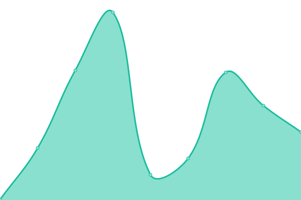

# [📈 Live Status](https://status.yatserver.com): <!--live status--> **🟧 Partial outage**

This repository contains the open-source uptime monitor and status page for [YATeam](https://www.yateam.cc), powered by [Upptime](https://github.com/upptime/upptime).

With [Upptime](https://upptime.js.org), you can get your own unlimited and free uptime monitor and status page, powered entirely by a GitHub repository. We use [Issues](https://github.com/YAT-Publish/status/issues) as incident reports, [Actions](https://github.com/YAT-Publish/status/actions) as uptime monitors, and [Pages](https://status.yatserver.com) for the status page.

<!--start: status pages-->
<!-- This summary is generated by Upptime (https://github.com/upptime/upptime) -->
<!-- Do not edit this manually, your changes will be overwritten -->
<!-- prettier-ignore -->
| URL | Status | History | Response Time | Uptime |
| --- | ------ | ------- | ------------- | ------ |
|  [YATeam Web](https://www.yateam.cc/yatassets/plugins/hermit/assets/js/3.1.6/hermit.js) | 🟥 Down | [ya-team-web.yml](https://github.com/YAT-Publish/status/commits/HEAD/history/ya-team-web.yml) | 

 525ms
     
 | 

<a href="https://status.yatserver.com/history/ya-team-web">87.14%</a>
    

|  [Hashi(橋)](https://hashi.icu) | 🟥 Down | [hashi.yml](https://github.com/YAT-Publish/status/commits/HEAD/history/hashi.yml) | 

 523ms
     
 | 

<a href="https://status.yatserver.com/history/hashi">87.51%</a>
    

|  [Listening Hole](https://th.hashi.icu) | 🟥 Down | [listening-hole.yml](https://github.com/YAT-Publish/status/commits/HEAD/history/listening-hole.yml) | 

 232ms
     
 | 

<a href="https://status.yatserver.com/history/listening-hole">55.36%</a>
    

|  [Haty](https://chat.hashi.sbs/img/element-icons/brands/github.de3b60e.svg) | 🟩 Up | [haty.yml](https://github.com/YAT-Publish/status/commits/HEAD/history/haty.yml) | 

 654ms
     
 | 

<a href="https://status.yatserver.com/history/haty">100.00%</a>
    

|  [Haty Server](https://chatserver.hashi.sbs/_synapse/admin/v1/server_version) | 🟥 Down | [haty-server.yml](https://github.com/YAT-Publish/status/commits/HEAD/history/haty-server.yml) | 

 373ms
     
 | 

<a href="https://status.yatserver.com/history/haty-server">100.00%</a>
    

|  [YATeam API](https://api.yateam.cc) | 🟥 Down | [ya-team-api.yml](https://github.com/YAT-Publish/status/commits/HEAD/history/ya-team-api.yml) | 

 359ms
     
 | 

<a href="https://status.yatserver.com/history/ya-team-api">55.73%</a>
    

|  [YAT OSS](https://files.yatserver.com/hashi/hashi/3d8fda85-1e67-45ed-8b31-3b0f02dd5c26.jpg) | 🟩 Up | [yat-oss.yml](https://github.com/YAT-Publish/status/commits/HEAD/history/yat-oss.yml) | 

 353ms
     
 | 

<a href="https://status.yatserver.com/history/yat-oss">100.00%</a>
    

|  [CodeProxy](https://codeproxy.net) | 🟥 Down | [code-proxy.yml](https://github.com/YAT-Publish/status/commits/HEAD/history/code-proxy.yml) | 

 1559ms
     
 | 

<a href="https://status.yatserver.com/history/code-proxy">92.10%</a>
    

|  [JsDelivr Proxy](https://jsd.yatserver.com/gh/YAT-Publish/status@master/replace.js) | 🟥 Down | [js-delivr-proxy.yml](https://github.com/YAT-Publish/status/commits/HEAD/history/js-delivr-proxy.yml) | 

 668ms
     
 | 

<a href="https://status.yatserver.com/history/js-delivr-proxy">99.30%</a>
    

|  [Hashi Random Images API(Temporary)](https://www.loliapi.com/acg) | 🟩 Up | [hashi-random-images-api-temporary.yml](https://github.com/YAT-Publish/status/commits/HEAD/history/hashi-random-images-api-temporary.yml) | 

 2153ms
     
 | 

<a href="https://status.yatserver.com/history/hashi-random-images-api-temporary">100.00%</a>
    

|  [GitHub Proxy](https://git.codeproxy.net) | 🟩 Up | [git-hub-proxy.yml](https://github.com/YAT-Publish/status/commits/HEAD/history/git-hub-proxy.yml) | 

 1659ms
     
 | 

<a href="https://status.yatserver.com/history/git-hub-proxy">96.49%</a>
    

|  [Picapica Download Page (Not a server or proxy)](https://picacg.yacg.asia) | 🟩 Up | [picapica-download-page-not-a-server-or-proxy.yml](https://github.com/YAT-Publish/status/commits/HEAD/history/picapica-download-page-not-a-server-or-proxy.yml) | 

 291ms
     
 | 

<a href="https://status.yatserver.com/history/picapica-download-page-not-a-server-or-proxy">100.00%</a>
    

|  QQBot Q | 🟥 Down | [qq-bot-q.yml](https://github.com/YAT-Publish/status/commits/HEAD/history/qq-bot-q.yml) | 

 0ms
     
 | 

<a href="https://status.yatserver.com/history/qq-bot-q">100.00%</a>
    

|  QQBot Z | 🟩 Up | [qq-bot-z.yml](https://github.com/YAT-Publish/status/commits/HEAD/history/qq-bot-z.yml) | 

 906ms
     
 | 

<a href="https://status.yatserver.com/history/qq-bot-z">91.87%</a>
    

|  [YAT Server Home Page](https://www.yatserver.com) | 🟩 Up | [yat-server-home-page.yml](https://github.com/YAT-Publish/status/commits/HEAD/history/yat-server-home-page.yml) | 

 2691ms
     
 | 

<a href="https://status.yatserver.com/history/yat-server-home-page">96.50%</a>
    

<!--end: status pages-->

[**Visit our status website →**](https://status.yatserver.com)

## 📄 License

- Powered by: [Upptime](https://github.com/upptime/upptime)
- Code: [MIT](./LICENSE) © [YATeam](https://www.yateam.cc)
- Data in the `./history` directory: [Open Database License](https://opendatacommons.org/licenses/odbl/1-0/)
