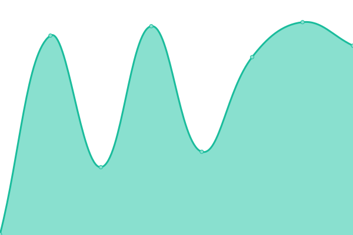
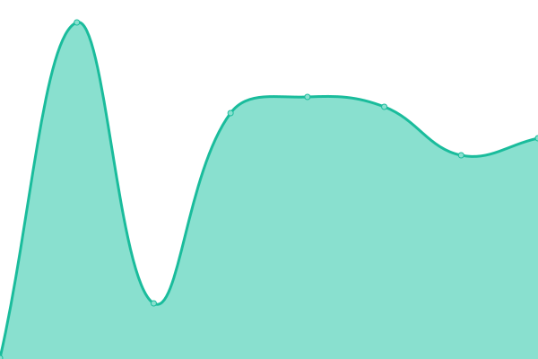

# [📈 Live Status](https://status.yatserver.com): <!--live status--> **🟧 Partial outage**

This repository contains the open-source uptime monitor and status page for [YATeam](https://www.yateam.cc), powered by [Upptime](https://github.com/upptime/upptime).

With [Upptime](https://upptime.js.org), you can get your own unlimited and free uptime monitor and status page, powered entirely by a GitHub repository. We use [Issues](https://github.com/YAT-Publish/status/issues) as incident reports, [Actions](https://github.com/YAT-Publish/status/actions) as uptime monitors, and [Pages](https://status.yatserver.com) for the status page.

<!--start: status pages-->
<!-- This summary is generated by Upptime (https://github.com/upptime/upptime) -->
<!-- Do not edit this manually, your changes will be overwritten -->
<!-- prettier-ignore -->
| URL | Status | History | Response Time | Uptime |
| --- | ------ | ------- | ------------- | ------ |
|  [Whimsies Status](https://status.whimsies.org) | 🟩 Up | [whimsies-status.yml](https://github.com/YAT-Publish/status/commits/HEAD/history/whimsies-status.yml) | 

 383ms
     
 | 

<a href="https://status.yatserver.com/history/whimsies-status">100.00%</a>
    

|  [YATeam Web](https://www.yateam.cc) | 🟩 Up | [ya-team-web.yml](https://github.com/YAT-Publish/status/commits/HEAD/history/ya-team-web.yml) | 

 150ms
     
 | 

<a href="https://status.yatserver.com/history/ya-team-web">100.00%</a>
    

|  [Hashi(橋)](https://hi.hashi.icu) | 🟩 Up | [hashi.yml](https://github.com/YAT-Publish/status/commits/HEAD/history/hashi.yml) | 

 148ms
     
 | 

<a href="https://status.yatserver.com/history/hashi">100.00%</a>
    

|  [Listening Hole](https://hole.hashi.icu) | 🟩 Up | [listening-hole.yml](https://github.com/YAT-Publish/status/commits/HEAD/history/listening-hole.yml) | 

 151ms
     
 | 

<a href="https://status.yatserver.com/history/listening-hole">100.00%</a>
    

|  [Haty](https://chat.hashi.sbs) | 🟩 Up | [haty.yml](https://github.com/YAT-Publish/status/commits/HEAD/history/haty.yml) | 

 499ms
     
 | 

<a href="https://status.yatserver.com/history/haty">100.00%</a>
    

|  [Haty Server](https://hashi.sbs/_matrix/consent) | 🟩 Up | [haty-server.yml](https://github.com/YAT-Publish/status/commits/HEAD/history/haty-server.yml) | 

 493ms
     
 | 

<a href="https://status.yatserver.com/history/haty-server">98.92%</a>
    

|  [Haty Call Server](https://cs.hashi.sbs) | 🟩 Up | [haty-call-server.yml](https://github.com/YAT-Publish/status/commits/HEAD/history/haty-call-server.yml) | 

 885ms
     
 | 

<a href="https://status.yatserver.com/history/haty-call-server">100.00%</a>
    

|  Haty Call Backend | 🟩 Up | [haty-call-backend.yml](https://github.com/YAT-Publish/status/commits/HEAD/history/haty-call-backend.yml) | 

 840ms
     
 | 

<a href="https://status.yatserver.com/history/haty-call-backend">100.00%</a>
    

|  [YATeam API](https://api.yateam.cc) | 🟩 Up | [ya-team-api.yml](https://github.com/YAT-Publish/status/commits/HEAD/history/ya-team-api.yml) | 

 110ms
     
 | 

<a href="https://status.yatserver.com/history/ya-team-api">100.00%</a>
    

|  [YAT OSS](https://files.yatserver.com/hashi-next/hashi/25e94b33-e005-400a-919e-73202ab40b0d.webp) | 🟩 Up | [yat-oss.yml](https://github.com/YAT-Publish/status/commits/HEAD/history/yat-oss.yml) | 

 163ms
     
 | 

<a href="https://status.yatserver.com/history/yat-oss">99.46%</a>
    

|  [CodeProxy](https://codeproxy.net) | 🟩 Up | [code-proxy.yml](https://github.com/YAT-Publish/status/commits/HEAD/history/code-proxy.yml) | 

 1254ms
     
 | 

<a href="https://status.yatserver.com/history/code-proxy">100.00%</a>
    

|  [JsDelivr Proxy](https://jsd.yatserver.com/gh/YAT-Publish/status@master/replace.js) | 🟩 Up | [js-delivr-proxy.yml](https://github.com/YAT-Publish/status/commits/HEAD/history/js-delivr-proxy.yml) | 

 138ms
     
 | 

<a href="https://status.yatserver.com/history/js-delivr-proxy">100.00%</a>
    

|  [Hashi Random Images API(Temporary)](https://www.loliapi.com/acg) | 🟩 Up | [hashi-random-images-api-temporary.yml](https://github.com/YAT-Publish/status/commits/HEAD/history/hashi-random-images-api-temporary.yml) | 

 2469ms
     
 | 

<a href="https://status.yatserver.com/history/hashi-random-images-api-temporary">99.70%</a>
    

|  [GitHub Proxy](https://git.codeproxy.net) | 🟩 Up | [git-hub-proxy.yml](https://github.com/YAT-Publish/status/commits/HEAD/history/git-hub-proxy.yml) | 

 920ms
     
 | 

<a href="https://status.yatserver.com/history/git-hub-proxy">100.00%</a>
    

|  [Whimsies Docs](https://docs.whimsies.org) | 🟩 Up | [whimsies-docs.yml](https://github.com/YAT-Publish/status/commits/HEAD/history/whimsies-docs.yml) | 

 221ms
     
 | 

<a href="https://status.yatserver.com/history/whimsies-docs">100.00%</a>
    

|  [Captcha](https://captcha.whimsies.org) | 🟥 Down | [captcha.yml](https://github.com/YAT-Publish/status/commits/HEAD/history/captcha.yml) | 

 199ms
     
 | 

<a href="https://status.yatserver.com/history/captcha">0.00%</a>
    

|  [YAT Server Home Page](https://www.yatserver.com) | 🟩 Up | [yat-server-home-page.yml](https://github.com/YAT-Publish/status/commits/HEAD/history/yat-server-home-page.yml) | 

 2430ms
     
 | 

<a href="https://status.yatserver.com/history/yat-server-home-page">100.00%</a>
    

<!--end: status pages-->

[**Visit our status website →**](https://status.yatserver.com)

## 📄 License

- Powered by: [Upptime](https://github.com/upptime/upptime)
- Code: [MIT](./LICENSE) © [YATeam](https://www.yateam.cc)
- Data in the `./history` directory: [Open Database License](https://opendatacommons.org/licenses/odbl/1-0/)
